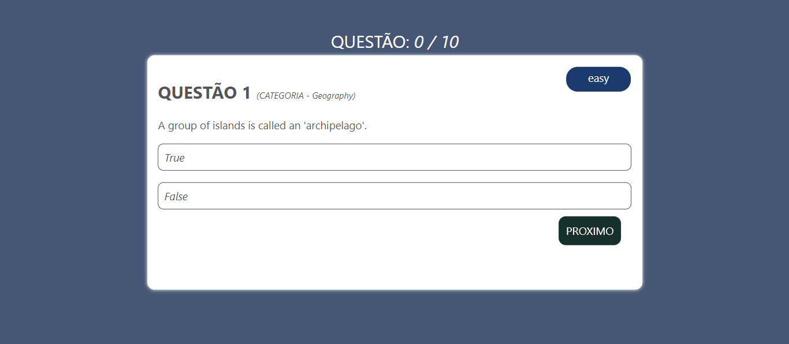
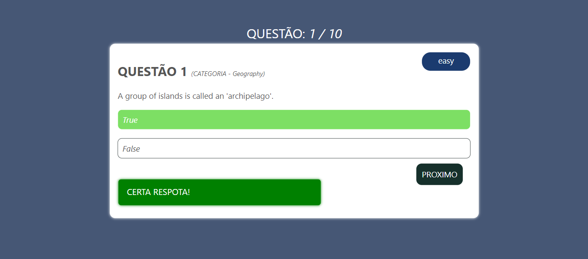
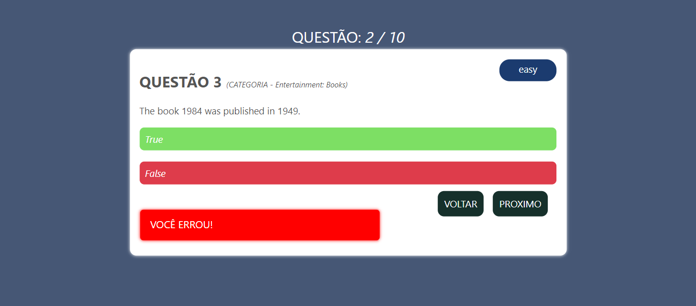
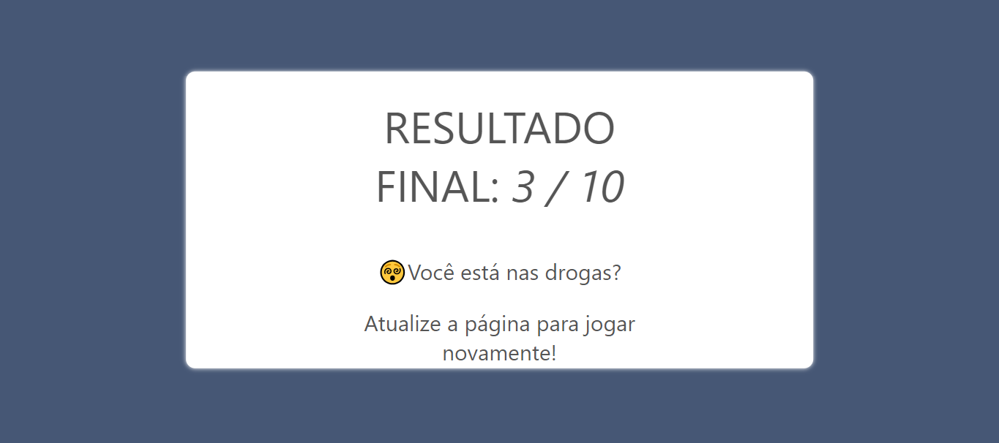

# QUIZ COM TRIVIA
👨‍🏫APP DE ENQUETES QUIZ COM SVELTE E API TRIVIA.

 <br> 
 <br> 
 <br> 
 <br>

## DESCRIÇÃO:
- Este quiz interativo baseado na web oferece aos usuários a oportunidade de testar seus conhecimentos por meio de uma série de perguntas de múltipla escolha. O principal objetivo é acertar o maior número possível de perguntas para alcançar uma pontuação alta.

- Proporcionando uma experiência envolvente e educativa, o aplicativo desafia os usuários a explorarem diferentes áreas de conhecimento. Com uma interface intuitiva e feedback visual imediato, é adequado para uma variedade de públicos, desde estudantes em busca de revisão até aficionados por trivia em busca de diversão e desafio.

## FUNCIONALIDADES:
1. **Quiz Principal**:
   - O coração do aplicativo é o quiz principal, onde as perguntas são exibidas individualmente para o usuário.
   - Cada pergunta é apresentada com suas opções de resposta, todas obtidas de uma API pública de perguntas e respostas.
   - O usuário pode selecionar uma das opções clicando nela. Após selecionar uma resposta, o usuário pode avançar para a próxima pergunta ou retroceder para a pergunta anterior.
   - O progresso do quiz é exibido, permitindo que o usuário saiba quantas perguntas já foram respondidas e quantas ainda faltam.
   
2. **Feedback Visual**:
   - Após responder a uma pergunta, o usuário recebe um feedback visual imediato.
   - Se a resposta estiver correta, uma mensagem de sucesso é exibida em verde.
   - Se a resposta estiver incorreta, uma mensagem de erro é exibida em vermelho.

3. **Pontuação e Resultado Final**:
   - O aplicativo mantém o controle da pontuação do usuário enquanto ele responde às perguntas.
   - Após responder todas as perguntas, o resultado final é exibido, mostrando a pontuação do usuário e uma mensagem personalizada com base na pontuação alcançada.
   - A pontuação é calculada como o número de perguntas corretamente respondidas em relação ao total de perguntas respondidas.
   
4. **Controle de Exibição**:
   - O aplicativo controla a visibilidade do resultado final do quiz.
   - Inicialmente, o resultado não é exibido. À medida que o usuário responde as perguntas, o componente responsável pela exibição do resultado final recebe eventos para atualizar a pontuação do jogador e controlar a visibilidade do resultado final.

5. **Personalização e Escalabilidade**:
   - O aplicativo é projetado para ser escalável e personalizável. As perguntas são obtidas de uma API pública, permitindo que novas perguntas sejam adicionadas facilmente.
   - Os estilos do aplicativo podem ser personalizados de acordo com as preferências do desenvolvedor ou do usuário.

## EXECUTANDO O PROJETO:
1. **Instalar as dependências do projeto**:
   - Execute o comando no diretório `CODIGO/`:
     ```cmd
     npm install
     ```
   Este comando instala todas as dependências listadas no arquivo `package.json` do seu projeto. 

2. **Executando o Aplicativo:**
   - Ainda no diretório `CODIGO/`, abra o terminal ou prompt de comando e digite o seguinte comando:
   ```bash
   npm run dev
   ```
   - Acesse o aplicativo no navegador visitando `http://localhost:5000/`.

3. **Usando o APP:**
   1. **Início do Quiz**:
      - Ao acessar o aplicativo, você será apresentado à tela inicial, onde encontrará um botão "INICIAR".
      - Clique no botão "INICIAR" para começar o quiz.

   2. **Responder às Perguntas**:
      - O quiz apresentará uma série de perguntas de múltipla escolha, uma de cada vez.
      - Leia cuidadosamente cada pergunta e as opções de resposta fornecidas.
      - Selecione a opção que você acredita ser correta clicando nela.

   3. **Feedback Visual**:
      - Após selecionar uma resposta, o aplicativo fornecerá feedback visual imediato:
      - Se a resposta estiver correta, você verá uma mensagem de sucesso em verde.
      - Se a resposta estiver incorreta, você verá uma mensagem de erro em vermelho.

   4. **Avançar ou Retroceder**:
      - Após fornecer uma resposta, você pode optar por avançar para a próxima pergunta ou retroceder para a pergunta anterior, se desejar.
      - Use os botões de navegação fornecidos para avançar ou retroceder entre as perguntas.

   5. **Finalização do Quiz**:
      - Continue respondendo às perguntas até chegar à última pergunta.
      - Após responder todas as perguntas, o resultado final será exibido automaticamente.

   6. **Visualização do Resultado Final**:
      - O resultado final mostrará sua pontuação total, indicando quantas perguntas você respondeu corretamente em relação ao número total de perguntas respondidas.
      - Você também verá uma mensagem personalizada com base na pontuação alcançada.

   7. **Reinício do Quiz**:
      - Se desejar, você pode reiniciar o quiz a qualquer momento clicando no botão "REINICIAR".
      - Isso permitirá que você comece o quiz novamente do início, permitindo mais tentativas para melhorar sua pontuação.

4. **Usando e configurando o `TRIVIA`:**
   - A API TRIVIA fornecida pelo Open Trivia Database (opentdb.com) é uma excelente ferramenta para obter questões de trivia em vários formatos e categorias. Aqui está um tutorial passo a passo sobre como usá-la:

   **Passo 1: Acesso à Documentação da API**
      - Vá para o site oficial do Open Trivia Database em [opentdb.com](https://opentdb.com/).
      - Na barra de navegação superior, clique em "API" para acessar a documentação da API.

   **Passo 2: Entendendo os Parâmetros da API**
      - A documentação da API fornece uma visão geral dos parâmetros que você pode usar ao fazer uma solicitação à API.
      - Os parâmetros comuns incluem:
      - `amount`: O número de perguntas a serem retornadas na solicitação.
      - `category`: A categoria da pergunta (por exemplo, ciência, esportes, história, etc.).
      - `difficulty`: A dificuldade das perguntas (fácil, médio ou difícil).
      - `type`: O tipo de pergunta (múltipla escolha ou verdadeiro/falso).

   **Passo 3: Fazendo uma Solicitação à API**
      - Use uma ferramenta de desenvolvimento web ou uma linguagem de programação para fazer uma solicitação HTTP GET para a URL da API.
      - A URL base da API é: `https://opentdb.com/api.php`.
      - Adicione os parâmetros desejados à URL da solicitação de acordo com suas preferências (Em `./CODIGO/src/QuizArea.svelte/linha-139`). Por exemplo:
      - `https://opentdb.com/api.php?amount=10&category=18&difficulty=easy&type=multiple` retorna 10 perguntas de ciência, todas de dificuldade fácil e no formato de múltipla escolha.

   **Passo 4: Recebendo e Manipulando os Dados**
      - Após fazer a solicitação à API, você receberá uma resposta no formato JSON contendo as perguntas e outras informações relacionadas.
      - Analise os dados JSON recebidos e extraia as perguntas, opções de resposta, respostas corretas e outras informações conforme necessário para o seu aplicativo ou projeto.

   **Passo 5: Tratamento de Erros**
      - Esteja ciente dos possíveis erros que podem ocorrer ao fazer solicitações à API, como erros de conexão, erros de solicitação malformada ou erros de resposta da API.
      - Implemente tratamento de erros adequado em seu código para lidar com essas situações e fornecer uma experiência de usuário robusta.

   **Passo 6: Uso Responsável e Atribuição**
      - Respeite as diretrizes de uso da API TRIVIA e garanta que você esteja usando-a de acordo com os termos de serviço do Open Trivia Database.
      - Se necessário, forneça atribuição adequada ao Open Trivia Database em seu aplicativo ou projeto, conforme especificado nas diretrizes de atribuição da API.

   **Passo 7: Experimentação e Personalização**
      - Experimente diferentes combinações de parâmetros da API para obter conjuntos exclusivos de perguntas que atendam às suas necessidades.
      - Personalize a apresentação e o estilo das perguntas em seu aplicativo ou projeto para criar uma experiência de usuário única e envolvente.

   **Passo 8: Feedback e Melhorias**
      - Compartilhe seu feedback com a equipe do Open Trivia Database para ajudar a melhorar e aprimorar a API TRIVIA.
      - Contribua para a comunidade compartilhando seus próprios projetos e aplicativos que usam a API TRIVIA e ajudando outros usuários a tirar o máximo proveito dela.
      
## NÃO SABE?
- Entendemos que para manipular arquivos em `HTML`, `CSS` e outras linguagens relacionadas, é necessário possuir conhecimento nessas áreas. Para auxiliar nesse aprendizado, oferecemos cursos gratuitos disponíveis:
* [CURSO DE HTML E CSS](https://github.com/VILHALVA/CURSO-DE-HTML-E-CSS)
* [CURSO DE JAVASCRIPT](https://github.com/VILHALVA/CURSO-DE-JAVASCRIPT)
* [CURSO DE NODEJS](https://github.com/VILHALVA/CURSO-DE-NODEJS)
* [CURSO DE SVELTE](https://github.com/VILHALVA/CURSO-DE-SVELTE)
* [CONFIRA MAIS CURSOS](https://github.com/VILHALVA?tab=repositories&q=+topic:CURSO)
* [ACESSE A API TRIVIA](https://opentdb.com/)

## CREDITOS:
- [PROJETO CRIADO PELO "manan30"](https://github.com/manan30/svelte-trivia)
- [PROJETO EDITADO PELO VILHALVA](https://github.com/VILHALVA)
